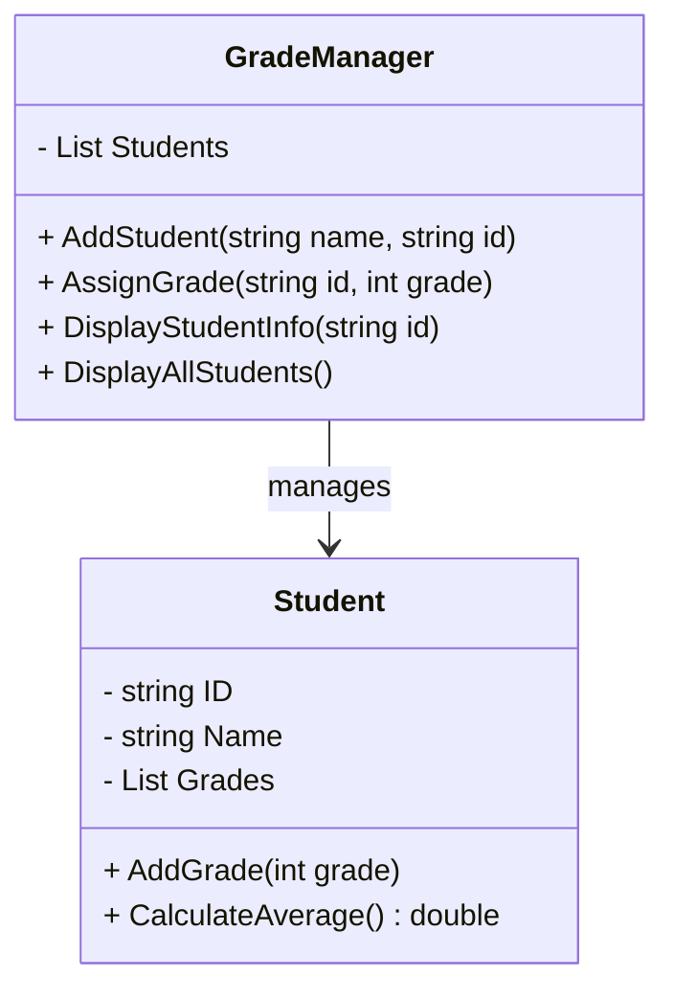
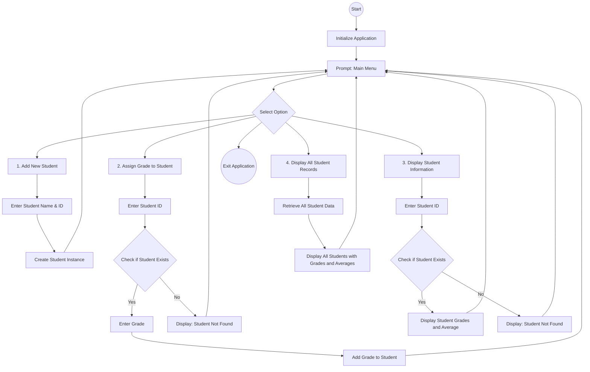

# Student Grade Management System

[](#)
[](https://github.com/zrfisaac/course.coursera-microsoft-v01/releases/download/v1.1.0/StudentGradeManagementSystem.zip)
[](https://github.com/zrfisaac/course.coursera-microsoft-v01/archive/refs/tags/v1.1.0.zip)

## Overview
**Student Grade Management System** is a C# console application developed for the **Microsoft - Foundations of Coding Full-Stack** course on Coursera. This project demonstrates essential programming concepts like control structures, loops, and methods in C#, and it provides a basic management tool for student grades. The application enables users to add students, assign grades, calculate averages, and display student records.

## Learning Objectives
This project was created to demonstrate proficiency in:
- **Foundational Full-Stack Concepts**: Applying principles of full-stack development in a C# console application.
- **Problem-Solving Techniques**: Designing algorithms and flowcharts for real-world tasks.
- **Control Structures and Loops**: Using `if-else` and `switch` statements, as well as `for` and `while` loops.
- **Modular Code Design**: Developing reusable components through methods and classes.
- **Requirements and Objectives**: Identifying and meeting project goals with structured project planning.
- **CI/CD Practices**: Building code with modularity and scalability in mind.

## Project Features
- **Add New Students**: Register students with names and unique IDs.
- **Assign Grades**: Add subject-specific grades to students.
- **Calculate Average Grades**: Compute the average grade for each student.
- **Display Student Records**: Show student details along with their grades and averages.

## Getting Started

### Prerequisites
- **.NET Core SDK** for C#
- **Visual Studio Code**

### Installation
1. Clone the repository:
   ```bash
   git clone https://github.com/zrfisaac/StudentGradeManager.git
   ```
2. Open the project in Visual Studio Code.
3. Build and run the solution.

## Project Requirements and Objectives
### Functional Requirements
- The application should allow the user to:
  - Add a student with a name and unique ID.
  - Assign grades to a student for different subjects.
  - Calculate and display the average grade for each student.
  - List all students with their grades and averages.

### Non-Functional Requirements
- **Usability**: Simple, easy-to-use console interface.
- **Efficiency**: Efficient data handling with minimal resource usage.
- **Maintainability**: Modular code that can be easily updated or expanded.

### Objectives
The goal is to create a reliable system for managing student grades, showcasing fundamental coding practices and creating a well-documented, modular application.

## Design Outline
### Classes
- **`Student`**: Represents a student with properties for name, ID, and grades.
- **`GradeManager`**: Manages the grade-related functionalities, including adding students, assigning grades, and calculating averages.

### Flowchart
Below is a flowchart outlining the basic operations of the **Student Grade Management System** using Mermaid syntax:



### Key Application Components
- **Add Student**: Registers a student with a name and unique ID.
- **Assign Grade**: Adds a grade to a student's list of grades.
- **Calculate Average**: Calculates the average of a student's grades.
- **Display Student Info**: Shows a student's name, ID, grades, and average.

## Example Classes in C#

### Program Class
```csharp
namespace StudentGradeManagementSystem
{
    internal class Program
    {
        static void Main(string[] args)
        {
            GradeManager manager = new GradeManager();
            bool exit = false;

            while (!exit)
            {
                Console.WriteLine("\nStudent Grade Management System");
                Console.WriteLine("1. Add Student");
                Console.WriteLine("2. Assign Grade");
                Console.WriteLine("3. Display Student Info");
                Console.WriteLine("4. Display All Students");
                Console.WriteLine("5. Exit");
                Console.Write("Choose an option: ");

                string choice = Console.ReadLine();
                Console.WriteLine("");
                switch (choice)
                {
                    case "1":
                        Console.Write("Enter student name: ");
                        string name = Console.ReadLine();
                        Console.Write("Enter student ID (integer): ");
                        int id = int.Parse(Console.ReadLine());
                        manager.AddStudent(name, id);
                        break;

                    case "2":
                        Console.Write("Enter student ID: ");
                        id = int.Parse(Console.ReadLine());
                        Console.Write("Enter grade: ");
                        int grade = int.Parse(Console.ReadLine());
                        manager.AssignGrade(id, grade);
                        break;

                    case "3":
                        Console.Write("Enter student ID: ");
                        id = int.Parse(Console.ReadLine());
                        manager.DisplayStudentInfo(id);
                        break;

                    case "4":
                        manager.DisplayAllStudents();
                        break;

                    case "5":
                        exit = true;
                        Console.WriteLine("Exiting the application.");
                        break;

                    default:
                        Console.WriteLine("Invalid option. Please try again.");
                        break;
                }
            }
        }
    }
}
```

### Student Class
```csharp
using System;
using System.Collections.Generic;
using System.Linq;
using System.Text;
using System.Threading.Tasks;

namespace StudentGradeManagementSystem
{
    public class Student
    {
        public string Name { get; set; }
        public int ID { get; set; }
        private List<int> Grades { get; set; }

        public Student(string name, int id)
        {
            Name = name;
            ID = id;
            Grades = new List<int>();
        }

        public void AddGrade(int grade)
        {
            Grades.Add(grade);
            Console.WriteLine($"Grade {grade} added for student {Name}.");
        }

        public double CalculateAverageGrade()
        {
            if (Grades.Count == 0) return 0;
            double sum = 0;
            Grades.ForEach(g => sum += g);
            return sum / Grades.Count;
        }

        public void DisplayInfo()
        {
            Console.WriteLine($"Student: {Name} | ID: {ID}");
            Console.WriteLine($"Grades: {string.Join(", ", Grades)}");
            Console.WriteLine($"Average Grade: {CalculateAverageGrade():F2}");
        }
    }
}
```

### GradeManager Class
```csharp
using System;
using System.Collections.Generic;
using System.Linq;
using System.Text;
using System.Threading.Tasks;

namespace StudentGradeManagementSystem
{
    public class GradeManager
    {
        private List<Student> Students = new List<Student>();

        public void AddStudent(string name, int id)
        {
            Students.Add(new Student(name, id));
            Console.WriteLine($"Student '{name}' with ID {id} added.");
        }

        public void AssignGrade(int id, int grade)
        {
            var student = Students.Find(s => s.ID == id);
            if (student != null)
            {
                student.AddGrade(grade);
            }
            else
            {
                Console.WriteLine("Student not found.");
            }
        }

        public void DisplayStudentInfo(int id)
        {
            var student = Students.Find(s => s.ID == id);
            if (student != null)
            {
                student.DisplayInfo();
            }
            else
            {
                Console.WriteLine("Student not found.");
            }
        }

        public void DisplayAllStudents()
        {
            Students.ForEach(student => student.DisplayInfo());
        }
    }
}
```

## Usage
Once the application is running, use the console commands to:
1. Add students by entering their names and IDs.
2. Assign grades to students by specifying their ID and grade.
3. Calculate and view the average grade for each student.
4. Display all student records along with their grades and averages.

## Course Information
This project was developed as part of the **[Microsoft Full-Stack Developer Professional Certificate](https://www.coursera.org/professional-certificates/microsoft-full-stack-developer)** on Coursera.

## Flowchart



### Explanation of Flowchart Steps

1. **Start**: The application initializes and displays the main menu.

2. **Main Menu Options**:
   - **Add New Student**:
     - Prompts the user for the student’s name and integer ID.
     - Creates a new `Student` instance with the provided information and stores it in the `GradeManager`.
   
   - **Assign Grade to Student**:
     - Prompts the user for the student’s integer ID.
     - Checks if the student exists:
       - If the student is found, prompts for a grade and assigns it to the student.
       - If the student ID is not found, displays a "Student Not Found" message.

   - **Display Student Information**:
     - Prompts the user for the student’s integer ID.
     - Checks if the student exists:
       - If found, displays the student’s information, including their grades and calculated average.
       - If the student ID is not found, displays a "Student Not Found" message.

   - **Display All Student Records**:
     - Retrieves and displays the records of all students, including each student’s grades and calculated averages.

3. **Exit Application**: Ends the program and exits the application. 

## Author
Developed by **Isaac Caires**  
Email: [zrfisaac@gmail.com](mailto:zrfisaac@gmail.com)  
Portfolio: [zrfisaac.github.io](https://zrfisaac.github.io)  

## License
This project is licensed under the [MIT License](LICENSE).
